# ASUS-Z170i-i9-9980HK-QQLS-RX550
ASUS Z170i Pro Gaming 搭配 i9-9980HK QQLS 魔改 U 黑苹果 EFI 驱动分享

# 整机方案

| **硬件**       | **规格**                                | **渠道**                                                     | **价格** |
| -------------- | --------------------------------------- | ------------------------------------------------------------ | -------- |
| **CPU**        | **1151针 QQLS I9-9980HK 套餐三**        | [淘宝](https://item.taobao.com/item.htm?spm=a1z09.2.0.0.12132e8dzG0SRF&id=625383750892&_u=u2ehsl2i2754) | 850      |
| **主板**       | 华硕 Z170I PRO GAMIMG                   | 咸鱼                                                         | 388      |
| **内存**       | 阿斯加特 洛极 T2 16GB DDR4 2666 * 2     | **用旧的**                                                   | 0        |
| **硬盘**       | 西数 SN550 1TB（读写 10TB 以内）        | 咸鱼                                                         | 409      |
| **机械**       | 西数 2.5 寸 笔记本 SATA 512GB  机械     | 咸鱼                                                         | 69       |
| **显卡**       | 讯景黑狼 RX550 2G 长220mm（几乎全新）   | 咸鱼                                                         | 310      |
| **电源**       | 鑫谷 SFX M450B 额定 350W （全新未拆封） | 咸鱼                                                         | 180      |
| **散热**       | 利民 AXP90-X53 （全新未拆封）           | 咸鱼                                                         | 120      |
| **机箱**       | 翼王 V1 标准版（几乎全新）              | 咸鱼                                                         | 200      |
| **显卡延长线** | 白色 20cm 全新 (机箱应该自带的)         | 咸鱼                                                         | 75       |
| **编程器**     | ch341a 编程器烧录器                     | [淘宝](https://item.taobao.com/item.htm?id=657376501361)     | 33       |

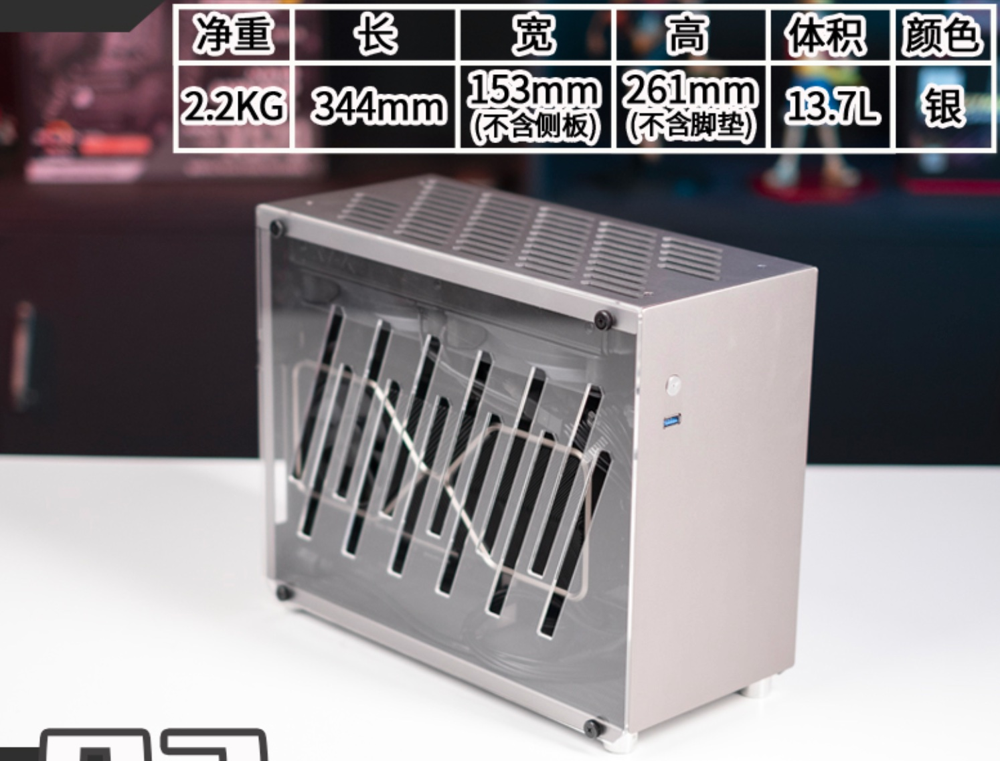 

- **方案优点**
  - 魔改 U 价格便宜，性价比很高
  - 笔记本 U 能耗低释放强，温度低
  - QQLS 体质超频灵活，可单核 5.0Ghz，全核稳定 4.7Ghz
  -  华硕 Z170I PRO GAMIMG 主板用料扎实
- **方案缺点**
  - 笔记本魔改 U 装机难度高，需要自己给主板刷 BIOS 
  - 黑苹果难度高，很有挑战性，不时候小白（不过既然你们看到这个项目 你们就可以白嫖 EFI 了）
  - ITX 配件整体价格偏贵，上 ATX/MATX 机箱的话，价格可以更低
  - ITX 的散热选择不多，全核超频烤鸡压不住，不过日常使用绝对绰绰有余了
  - BIOS 超频对小白不友好，需要多多尝试才行

# 选购理由

1. 夏天到了，我的 intel 2019 款 MBP 16 越来越烫，越来越卡， 这不能忍，得想办法搞个小主机带到工作来工作办公
2. 一开始看中了 intel NUC 8259U 的小主机，确实很小巧，黑苹果也很方便，但是散热和性能释放依然差点意思，故体验了几天就出掉了
3. 因为自己的有 i7-10700 + RX 6600XT 的主力机器了，所以不需要再配置一个标准的主机了，性能比笔记本和 NUC 强就行，越小巧越好
4. UHD 630 核显带多个 4k 肯定是卡的不行的，而且我还有 4k 144Hz 高刷显示器，所以必须得整个 AMD 免驱独显，核显完全不考虑了
5. RX 550 640SP 2GB 是黑苹果免驱的，目前同时外接 2个 4k 1个 1080P 绰绰有余，310元的价格，性能却相当于 4 个核显左右的性能
6. 因为实际需求并不剪视频，并不打游戏，RX550 2GB 版本完全足够了，日常办公、刷网页都很丝滑流程，国光我很满意了
7. ITX 的电源价格都比较贵，RX 550 2GB 还无需供电，鑫谷 SFX M450B 额定 350W 完全满足整套主机方案的供电了

# 坑点记录

1. 这个主板的 BIOS 是可拆卸的，拆下来使用编程器刷魔改 BIOS 耗费了不少时间（第一次刷这个玩意）
2. QQLS 魔改 U 毕竟挑内存，酷一开始兽牌子的内存就无法双通道跑满，换了阿斯加特牌子才搞定双通道 2666Mhz
3. RX550 开核开挂了几次，其实不开核也可以使用，不建议小白开核，最后使用物理连接线短接显卡 BIOS 1、8针脚才搞定
4. 魔改 U 网上都是说无法睡眠，实际上国光实践了一下，确实有坑，但是最后再定制 USB 然后改 Mac Pro 7,1 机型，可以搞定睡眠，而且核显依然可以工作
5. BIOS 超频需要自己慢慢摸索，极限单核 5.0G，多核的话看体质吧，总之调教这块也耗费了很多时间

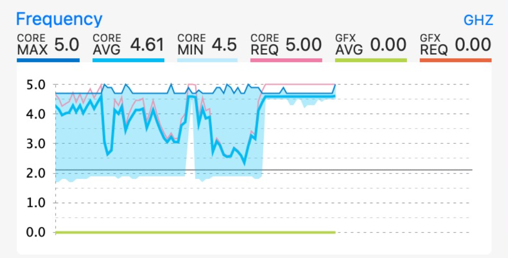

# 跑分情况

Geekbench5 单核跑分 1333（单核超 5.0G 的跑分情况），多核心 7139 分，单核可以吊打我的 i7-10700了，多核也就弱一点点：

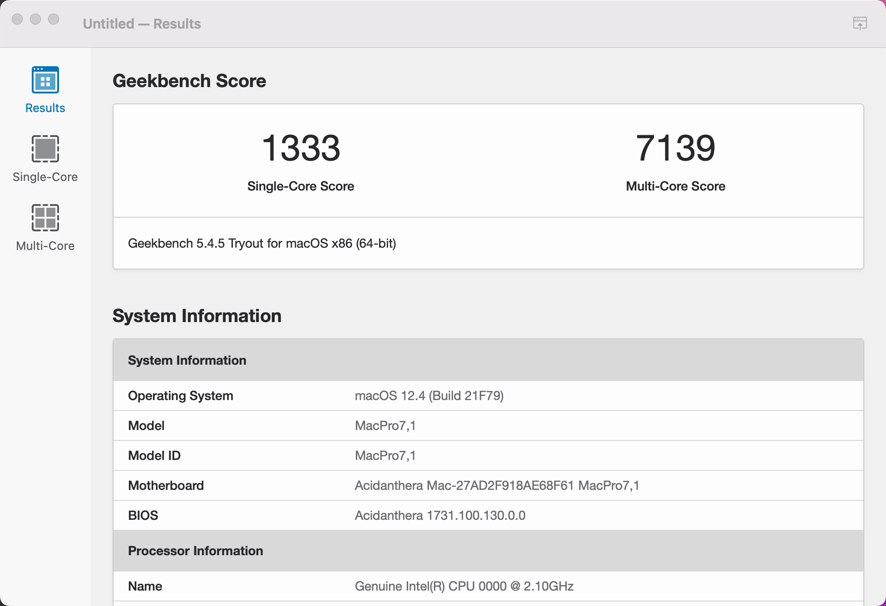 

R23 多核跑分 10608 分，略低于解锁功耗墙的 i7-10700，日常使用稳定也不高，国光我很满意了：

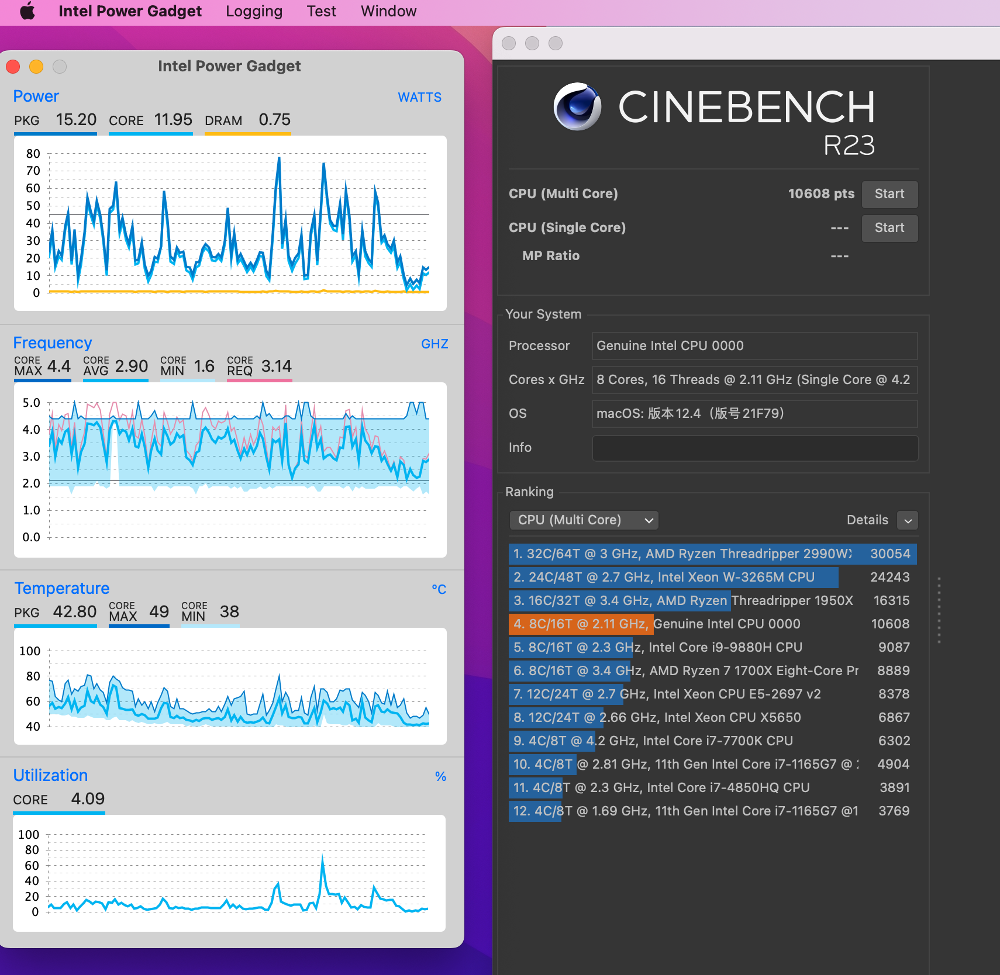

# 黑果完美度

使用的是 Mac Pro 7,1 机型，这个机型核显优先级不高，可以完美解决魔改 U 睡眠问题，而且核显依然可以正常工作：

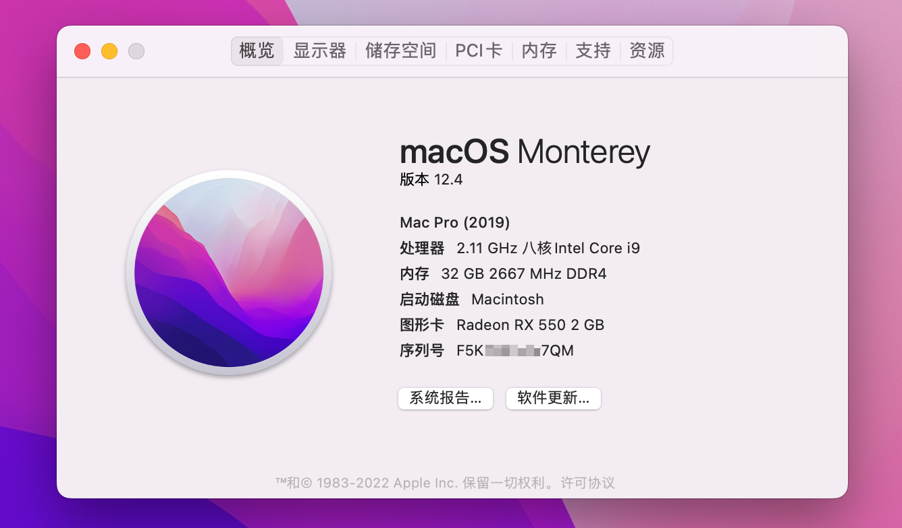  

核显正常工作，且解码均很正常，哪怕是睡眠唤醒后，解码也是正常的（这个网上貌似很多人都不行哦）：

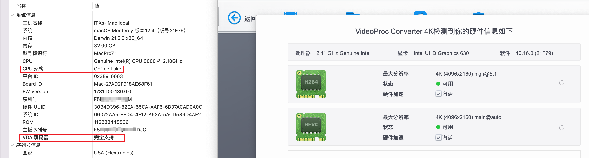 

 ASM1142 的 USB 3.1 驱动器在定制 USB 后也可以完美的工作：

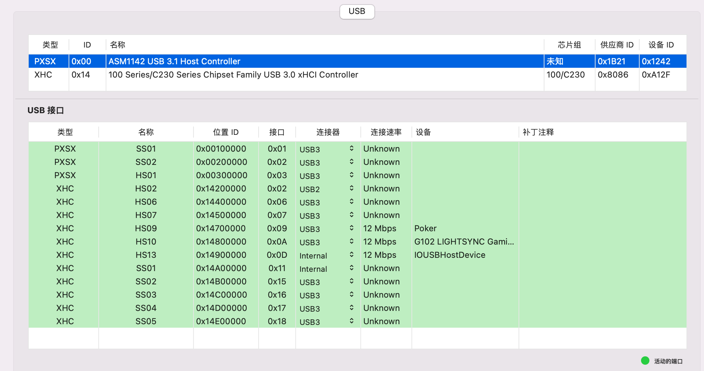 

自带的 Intel 3168NGW（不知道是否都是这个型号）完全足够使用，蓝牙也不像免驱的网卡一样存在干扰问题， Apple Music 无损音乐也流畅播放：

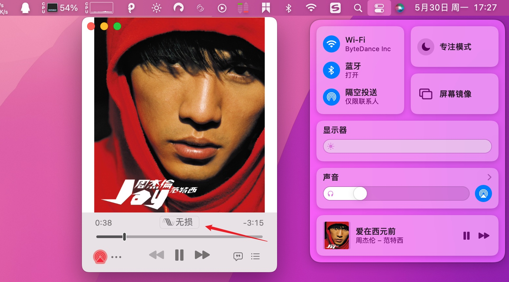  

SN550 性能弱了一点，但是价格便宜发热还低，ITX 再适合不过了，其实这个读写速度也完全足够我日常使用了：

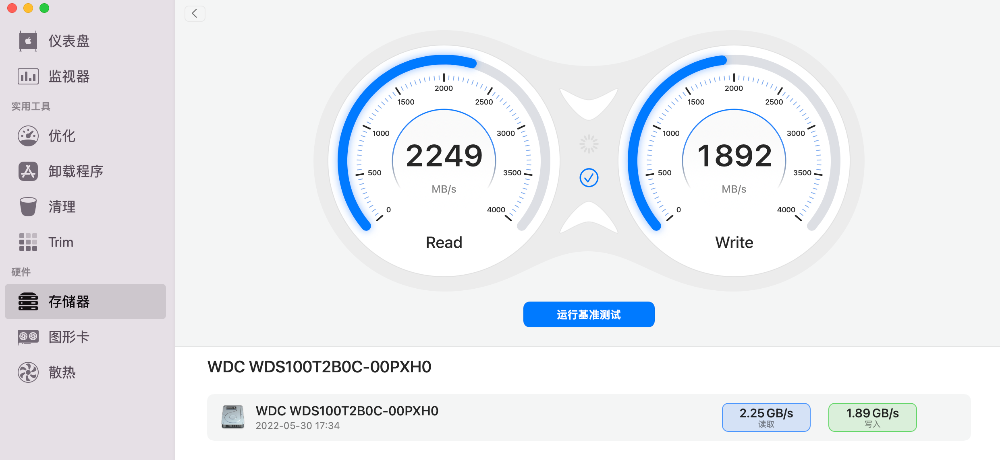

目前这套主机使用了好几天了，还没有出现过无缘无故重启的情况，确实很稳定：

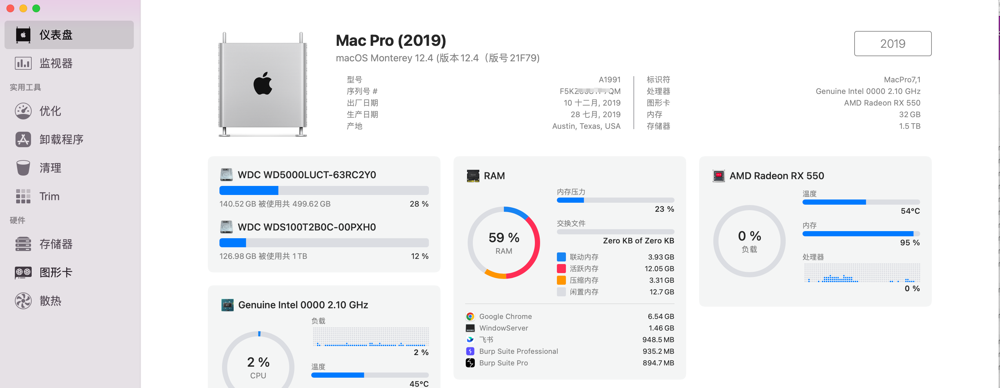 

日常工作开十几个应用的情况下， CPU 温度也就 50℃ 左右，这可完爆我之前的 16 寸 MBP 了：

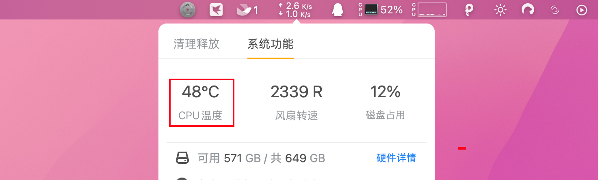

总之，目前这套 ITX 小主机完美解决了我之前的痛点，而且性能也超出我的预期了，我挺满意的，最后也将这套方案分享给热爱黑苹果的大家。

溜了溜了，晒 1 个最近入手的小屏幕的图就结束本文吧：

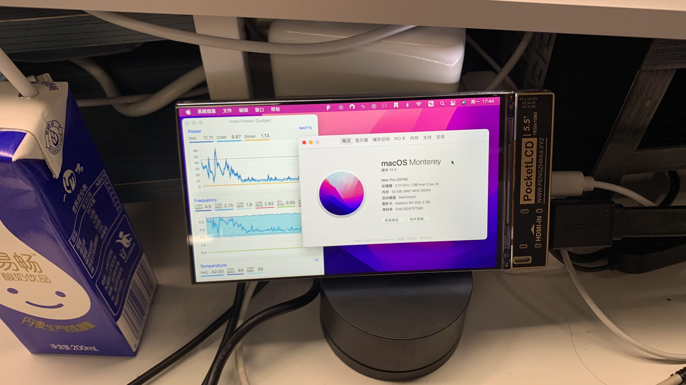 
